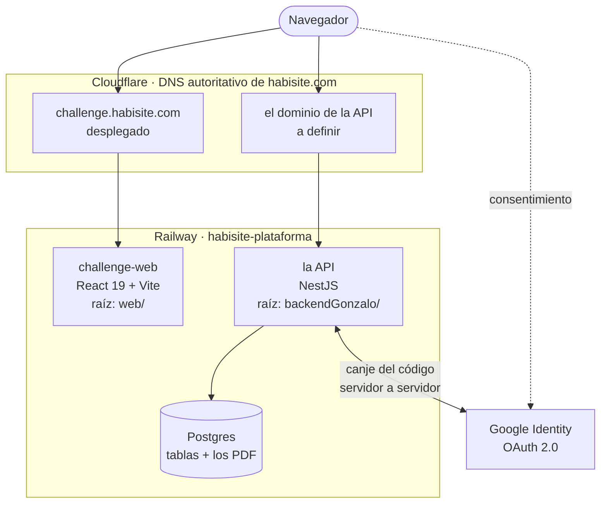
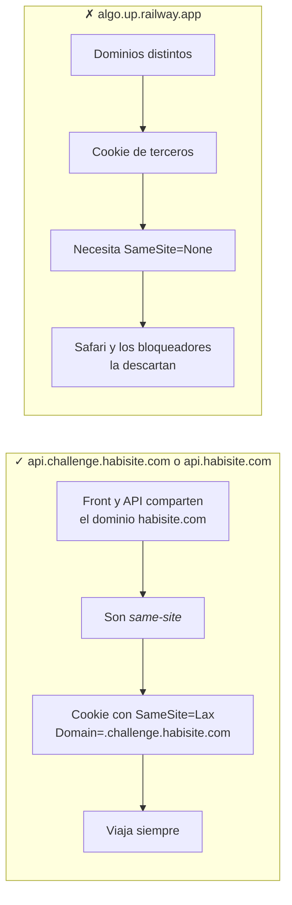
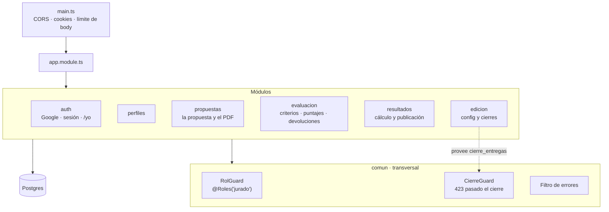

# 02 · Arquitectura

## No son microservicios

Es **una sola aplicación NestJS**: un proceso, un deploy, una base. Los módulos
son carpetas que agrupan código adentro del mismo proceso — no hay red entre
ellos, `auth` llama a `perfiles` con una llamada a función común y corriente.

Es a propósito. `CLAUDE.md` §1 lo fundamenta: son una sola app con una sola base
para que **pasar el puntaje del jurado al participante sea una consulta**, no
trabajo de integración. Partirlo en servicios rompería lo único que el diseño
quiso proteger.

## Despliegue

> **Cambió el 08.09.** El proyecto viejo de Railway se borró con autorización
> explícita: se fueron la API Java de `api.habisite.com`, la integración de
> WhatsApp y el Postgres de 1.1 GB, cuya base tenía contactos viejos que se
> descartaron. El código de esos servicios quedó en `Valebongi/Habisite` y sus
> variables de entorno, respaldadas fuera de git.

Proyecto **`habisite-plataforma`** (`2ddeacf4-f570-4ea9-afc7-8428393fbaf4`),
workspace *GrowthIMBAR's Projects*, único entorno `production`.

| Servicio | Root | Dominio | Estado |
|---|---|---|---|
| `challenge-web` | `web/` | `challenge.habisite.com` | **desplegado** |
| *(la API)* | `backendGonzalo/` | a definir | no existe |
| *(la base)* | — | — | no existe |



**Un repo, un servicio por carpeta.** Cada servicio de Railway apunta al mismo
repo con su propio *Root Directory* y sus *watch paths*, así los commits del
back no redespliegan el front.

**Fijá el Root Directory antes del primer deploy.** Railway lanza un build al
crear el servicio, y sin root configurado construye desde la raíz del repo
—donde no hay `package.json`— y falla. Lo aprendió Tomás desplegando el front.

**El front es estático y necesita un proceso escuchando.** `vite build` produce
`dist/`, y el servicio lo sirve con `serve -s dist`. El `-s` hace que cualquier
ruta desconocida caiga en `index.html`: hoy no hace falta, pero sí en cuanto los
paneles tengan rutas propias.

## Por qué la API necesita su propio subdominio

Con el borrado del proyecto viejo, **`api.habisite.com` quedó libre**. Sirve
cualquiera de los dos nombres; lo que no da lo mismo es que esté **dentro de
`habisite.com`**, porque de eso depende que la sesión funcione.



El modo de fallar del camino de la derecha es el peor posible: al usuario lo
desloguea solo, cada tanto, y **solo en algunos navegadores**. No falla siempre,
así que es carísimo de diagnosticar.

Lo único que cambia entre los dos nombres buenos es el `Domain` de la cookie:
con `api.challenge.habisite.com` alcanza `.challenge.habisite.com`; con
`api.habisite.com` hay que abrirla a `.habisite.com`, que es más amplio de lo
necesario. Por eso sigo prefiriendo el primero.

## Módulos de la API



## Estructura de carpetas

Un módulo por funcionalidad, y adentro de cada uno sus capas. **Las capas que
usabas siguen estando** —entity, repository, service, controller—: lo único
distinto es que agrupa la carpeta de la funcionalidad y no la de la capa.

```
backendGonzalo/
├─ src/
│  ├─ main.ts                  CORS, cookies, tope de body, filtro, Swagger
│  ├─ app.module.ts            arma el conjunto y registra los guards globales
│  ├─ documentacion.ts         la configuración de OpenAPI
│  ├─ generar-contrato.ts      escribe contrato/openapi.yaml
│  ├─ configuracion/
│  │  └─ entorno.ts            el .env tipado y validado al arrancar
│  ├─ comun/
│  │  ├─ base-de-datos/        el Pool de pg, inyectable en todo el proyecto
│  │  ├─ autorizacion/         @Roles(), @Publico(), @UsuarioActual(), guards
│  │  └─ filtros/              una sola forma de error para toda la API
│  ├─ migrador/                el corredor de migraciones
│  ├─ salud/                   GET /salud
│  ├─ auth/                    Google, sesión, SesionGuard
│  ├─ perfiles/                inscripción, /yo, la lista blanca
│  ├─ edicion/                 configuración y etapas del concurso
│  ├─ equipos/                 alta, invitaciones, bajas
│  ├─ propuestas/              la propuesta, el PDF y su entrega
│  ├─ evaluacion/              criterios, reparto, preselección, puntajes
│  └─ resultados/              cálculo del ranking y publicación
├─ migraciones/
│  ├─ 001-esquema.sql          las 12 tablas con sus restricciones
│  └─ 002-semillas.sql         criterios, edición y administradores
└─ docs/                       esta bitácora
```

Adentro de un módulo:

```
propuestas/
├─ propuesta.entity.ts         la forma del dato y la conversión desde SQL
├─ propuestas.repository.ts    el SQL, nada más
├─ propuestas.service.ts       las reglas: cierre, permisos, rangos HTTP
├─ propuestas.controller.ts    las rutas y los códigos HTTP
├─ archivo.service.ts          la validación del PDF
├─ dto/                        qué acepta y qué devuelve la API
└─ propuestas.module.ts        qué expone al resto
```

El `module.ts` declara qué sale afuera. Si `evaluacion` necesita leer
propuestas, importa el módulo y usa lo que este exporta — no mete la mano en el
repositorio ajeno. Esa es la encapsulación que el corte por capa no da.

## Cómo está armado el código

Decisiones del andamiaje que conviene conocer antes de agregar un módulo.

**Nest 12 en ESM puro.** El `package.json` lleva `"type": "module"`, así que los
imports relativos van con extensión `.js` aunque el archivo sea `.ts`
(`./app.module.js`). Es lo que genera el CLI actual; TypeScript 6, vitest y
oxlint en vez de jest y eslint.

**El `.env` se valida al arrancar.** `configuracion/entorno.ts` es una clase con
decoradores de `class-validator`; `ConfigModule` la usa y, si algo falla, el
proceso no levanta y dice cuál es la variable. Los chequeos codifican las
trampas que ya nos hicieron perder tiempo:

```
· GOOGLE_CLIENT_SECRET: no empieza con GOCSPX-: probablemente sea el valor
  enmascarado de la consola
· JWT_SECRET: tiene que tener al menos 32 caracteres (openssl rand -base64 48)
· ZONA_HORARIA: no es una zona IANA válida (ej. America/Argentina/Buenos_Aires)
```

**El Pool de Postgres es perezoso.** `BaseDeDatos` construye el `Pool` pero no
abre ninguna conexión hasta la primera consulta: la API levanta aunque la base
todavía no exista. Es un módulo `@Global()`, así que cualquier servicio lo
inyecta sin importar nada. Ofrece `consultar()` y `transaccion()`; los
repositorios no tocan `pg` directo.

**`RolGuard` es global pero opcional por ruta.** Está registrado como `APP_GUARD`
y solo actúa donde hay `@Roles('jurado')`; sin el decorador, la ruta pasa. Lee
`request.usuario`, que va a colgar el guard de sesión del módulo `auth` — ese
tiene que registrarse antes, porque los guards globales corren en orden.

**`CierreGuard` se aplica por ruta** con `@UseGuards(CierreGuard)` sobre toda
escritura de la propuesta. Consulta `edicion` y compara con el reloj del
servidor:

```sql
now() <= cierre_entregas + make_interval(mins => coalesce(margen_gracia_minutos, 0))
```

Sin fecha cargada, deja pasar. Sin fila en `edicion`, responde `503`: la
edición no está configurada. Cerrado, responde `423 Locked`.

**Todos los errores tienen la misma forma.** `FiltroDeErrores` envuelve lo que
Nest lanza y responde siempre así — es parte del contrato con el front:

```json
{
  "estado": 404,
  "mensaje": "Cannot GET /no-existe",
  "detalles": ["…solo cuando el ValidationPipe rechaza campos, uno por renglón"],
  "ruta": "/no-existe",
  "hora": "2026-09-08T21:41:02.716Z"
}
```

Los `500` van al log con su stack; al cliente le llega «Algo falló de nuestro
lado» y nada más.

**CORS con un solo origen y credenciales.** `FRONTEND_URL` es el único origen
habilitado. Con la cookie de sesión viajando, `*` no vale: el navegador lo
rechaza. Un origen ajeno recibe la cabecera con el valor del front, nunca el
suyo, así que su navegador lo bloquea.

**`GET /salud` no toca la base.** Es lo que Railway consulta para saber que el
proceso está vivo; una base caída no tiene que tumbar el deploy.

### El corredor de migraciones

Sin librería: lee los `.sql` de `migraciones/` en orden, corre cada uno en una
transacción y anota cuáles aplicó en una tabla `migraciones`. Correrlo dos veces
no hace nada.

Guarda el `sha256` de cada archivo: **si una migración ya aplicada cambió, corta
en vez de seguir**. Editar una migración vieja deja la base y el repo diciendo
cosas distintas, y eso se descubre tarde y mal.

### Los dos guards globales, en orden

```
SesionGuard   lee la cookie, carga el perfil de la base,
              cuelga request.usuario
      ↓
RolGuard      mira @Roles() y compara
```

El orden importa y está fijado en `app.module.ts`: los guards globales corren en
el orden en que se declaran. Todo exige sesión **por defecto**; lo que tiene que
ser accesible sin entrar lleva `@Publico()`. Es más seguro olvidarse de abrir
algo que olvidarse de cerrarlo.

**El rol se lee de la base en cada request**, nunca del token: si administración
bloquea a alguien, deja de entrar en el acto y no cuando venza su cookie.

### El contrato para el front

`contrato/openapi.yaml` se genera desde los decoradores de los controladores,
así que no puede quedar desactualizado respecto del código:

```bash
npm run build && npm run contrato
```

Con la API corriendo, `/docs` sirve la documentación navegable. El detalle de
qué endpoint usa cada pantalla está en
[07 · La API para el front](07-api-para-el-front.md).

### Comandos

```bash
npm run start:dev    # con recarga · http://localhost:3000/salud
npm run build        # tsc → dist/
npm run start:prod   # node dist/main   ← lo que corre Railway
npm run migrar       # aplica las migraciones pendientes
npm run contrato     # regenera contrato/openapi.yaml
npm run lint         # oxlint src/ test/
npm run format       # prettier
npm run test:e2e     # levanta AppModule entero y pega a /salud
```

## Estado

**Fases A, B y C hechas (08–09.09).** Los siete módulos del concurso están
escritos, con 34 endpoints. Compila, pasa lint y el e2e, y bajo Node puro
responde: `/salud` abierto, todo lo demás `401` sin sesión, `/auth/google`
redirigiendo a Google con los tres permisos correctos, la validación de DTO
devolviendo un renglón por campo, y los `500` sin filtrar detalles internos.

`contrato/openapi.yaml` está generado: **34 operaciones y 21 esquemas**. Tomás
ya puede sacar sus tipos.

**10.09 · la base local anda.** `habisite_challenge` creada en el Postgres 18
nativo, las dos migraciones aplicadas y la API comprobada contra datos reales:
alta de inscripción, choque de correo repetido con `409`, `GET /yo` con rol y
edición, y los siete criterios sumando 1. Cero `500` en el log.
Ver [08 · La base de datos local](08-base-de-datos-local.md).

**Falta el despliegue** —el servicio de la API y el de Postgres en Railway— y el
envío de correos, que necesita verificar el dominio remitente.
