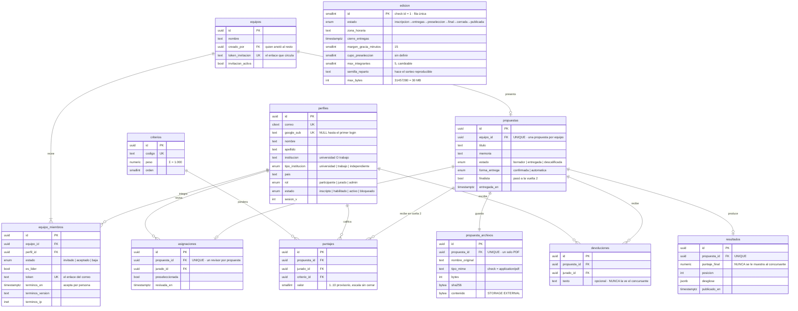

# 03 · Modelo de datos

Doce tablas. Incorpora los cambios de la reunión con Sol del 08.09: equipos en
vez de participación individual (ver [05](05-inscripcion-por-grupo.md)) y
evaluación en dos vueltas (ver [06](06-evaluacion-en-dos-vueltas.md)).

## Diagrama entidad-relación



## Las restricciones imponen las reglas del concurso

No están en el código, están en la base. Una pantalla nueva que se olvide de
chequear algo no las puede violar.

| Restricción | Regla que impone |
|---|---|
| `propuestas.equipo_id` UNIQUE | Una propuesta por equipo |
| `equipo_miembros(perfil_id)` UNIQUE parcial donde `estado='aceptado'` | Nadie compite en dos equipos |
| `asignaciones.propuesta_id` UNIQUE | En la vuelta 1, un solo revisor por propuesta |
| `puntajes(propuesta_id, jurado_id, criterio_id)` UNIQUE | Un jurado no carga dos veces el mismo criterio |
| `propuesta_archivos.propuesta_id` UNIQUE | Un solo PDF por propuesta |
| `puntajes.valor` check 1..10 | La escala no se viola ni por error de código |
| `coherencia_entrega` check | `entregada` siempre tiene fecha; `borrador` nunca |

## Cuatro decisiones que conviene entender

**El PDF vive en su propia tabla.** Si el `bytea` estuviera en `propuestas`,
cualquier listado del jurado arrastraría 30 MB por fila sin que nadie los pida.

**`contenido` va con `STORAGE EXTERNAL`.** Por defecto Postgres intenta
comprimir el `bytea`, lo que con un PDF es CPU tirada y encima rompe la lectura
por partes: para devolver los primeros 64 KB tendría que descomprimir los 30 MB
enteros.

**No hay tabla de «evaluación terminada».** Un jurado terminó con un finalista
cuando tiene sus 7 filas en `puntajes`. Es un `count`, no un flag que pueda quedar
desincronizado.

**`resultados` es interna.** El concursante **no ve puntaje, ni nota, ni ningún
valor**. Esta tabla existe para el acta y para que la organización arme el
podio, no para mostrársela a nadie de afuera.

**`devoluciones` también es interna.** Sol lo escribió en el PDF: «total no hay
devolución a ellos». Es una nota del jurado para la deliberación, opcional, y
**sin interruptor de visibilidad**, porque no hay ninguna pantalla donde el
concursante pueda leerla.

> ADVERTENCIA · `req-concursantes.md` §4.18 dice lo contrario —que la devolución
> es lo único que el concursante recibe— y la §1 de `CLAUDE.md` la convirtió en
> el fundamento de que sea una sola app. **Hay que avisarle a Tomás**, que ya
> construyó esa sección del panel.

**La escala de puntuación no está cerrada.** `req-jurado.md` §4.1 la lista como
pregunta abierta. Se escribe `smallint` con rango 1 a 10, que es lo más
probable; si cambia, es un `alter column` de una línea mientras no haya datos
reales.

## Nadie entra sin estar inscripto

Los perfiles **no nacen del login**. Nacen del formulario de inscripción o de una
invitación de administración. Si alguien entra con una cuenta de Google que no
figura, la API responde `403`.

**El alta es automática al inscribirse:** completar el formulario habilita, sin
que nadie tenga que aprobar uno por uno. Administración puede bloquear después.
Así se conserva el control sin armar un cuello de botella el día que abre la
convocatoria.

> ADVERTENCIA · `req-concursantes.md` §1.2 asume lo contrario —que el perfil se
> crea solo en el primer ingreso con rol participante— y Tomás está
> construyendo sobre eso.

Es una lista blanca, y es la razón de que `perfiles.estado` exista: una fila
puede estar creada y todavía no haber entrado nunca (`google_sub IS NULL`). El
detalle del recorrido está en
[04 · Máquinas de estado](04-maquinas-de-estado.md).

## Los dos caminos a «entregada»

Un borrador llega a `entregada` porque el equipo confirma, **o porque venció el
plazo**. Al cumplirse `cierre_entregas` más los 15 minutos, un proceso pasa todo
borrador que tenga archivo a entregado, sin que nadie haga nada.

`forma_entrega` deja registro de por cuál de los dos caminos entró. Un borrador
sin ningún archivo queda afuera: marcarlo entregado le daría al jurado una
propuesta vacía.

## El margen de gracia

Sol pidió un margen chico después del cierre, porque «siempre piden que se lo
suban porque pasó algo». Son **15 minutos**.

```sql
-- El guard de cierre compara contra el cierre MÁS el margen.
now() <= cierre_entregas + (margen_gracia_minutos || ' minutes')::interval
```

No hace falta ninguna columna extra para saber quién entregó dentro del margen:
sale de comparar `entregada_en` contra `cierre_entregas`. Conviene poder
listarlo, porque es la clase de dato que alguien va a pedir.

## Dónde vive el anonimato entre jurados

No hay tabla ni columna: es una sola cláusula, y tiene que existir en un único
lugar del código. Aplica sobre todo en la vuelta 2, que es donde los tres
califican lo mismo.

```sql
select * from puntajes
 where propuesta_id = $1
   and ( $estado_edicion in ('cerrada','publicada')  -- ya cerró: se ve todo
         or jurado_id = $actor );                    -- si no: solo lo propio
```

## Cómo se calcula el puntaje

Solo sobre finalistas, y promediando a los tres jurados. La consulta completa
está en [06 · Evaluación en dos vueltas](06-evaluacion-en-dos-vueltas.md).

### Los siete criterios

**No están confirmados.** `req-jurado.md` §3.2 avisa que salieron de las bases
del sitio viejo y que el equipo todavía no habló con la gente del jurado. Por eso
viven en tabla y la pantalla de puntuación se genera desde ahí: si se programa
contra siete criterios fijos, hay que rehacerla.

| Criterio | `codigo` | Peso |
|---|---|---:|
| Creatividad y originalidad | `creatividad` | 0.350 |
| Narrativa arquitectónica y experiencia | `narrativa` | 0.200 |
| Integración espacial con el entorno | `integracion` | 0.200 |
| Sostenibilidad | `sostenibilidad` | 0.100 |
| Viabilidad técnica | `viabilidad` | 0.050 |
| Calidad de presentación | `presentacion` | 0.050 |
| Cumplimiento de entregables | `entregables` | 0.050 |
| | | **1.000** |

## Estado

Diseñado y documentado. **Todavía no hay ninguna migración escrita en disco.**
