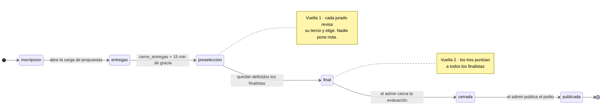
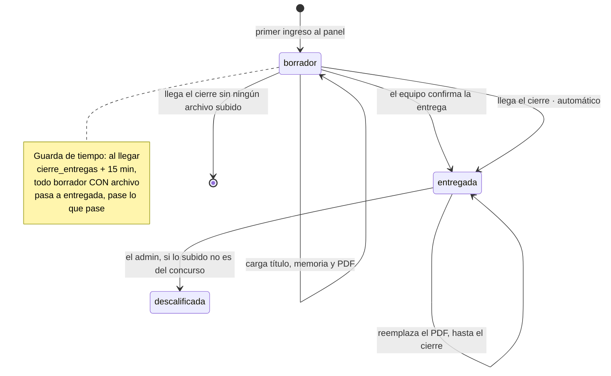
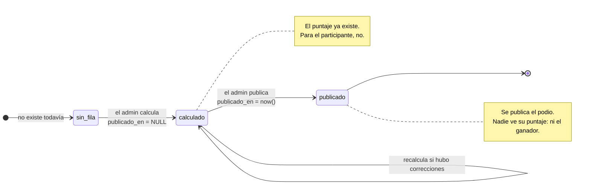
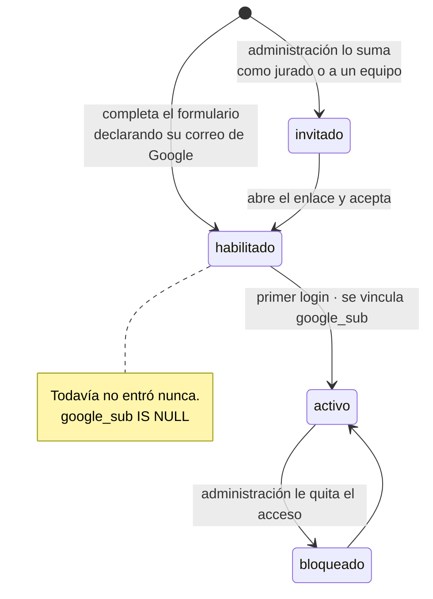
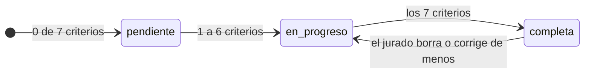

# 04 · Máquinas de estado

Cuatro cosas cambian de estado en el sistema. Tres se guardan en una columna; la
cuarta se calcula y **por eso no se puede desincronizar**.

---

## 1 · La edición del concurso

Una sola fila en `edicion`. Gobierna qué puede hacer cada rol en cada momento:
es el interruptor general del concurso.



Las dos últimas transiciones **solo las puede hacer el admin** y son las únicas
acciones exclusivas de ese rol (`CLAUDE.md` §5.3).

El paso de `entregas` a `preseleccion` lo dispara el reloj del servidor contra
`cierre_entregas` más los **15 minutos de gracia**, no un botón. Con zona
horaria explícita.

La evaluación se parte en dos porque cada jurado revisa solo un tercio del
total. El detalle y el porqué están en
[06 · Evaluación en dos vueltas](06-evaluacion-en-dos-vueltas.md).

---

## 2 · La propuesta

Columna `propuestas.estado`, enum `borrador | entregada | descalificada`.

**Hay dos caminos por los que un borrador llega a entregada**, y el segundo no
depende de que nadie haga nada.



### La guarda de tiempo

Al vencer `cierre_entregas` más los 15 minutos de gracia, un proceso recorre los
borradores y los pasa a `entregada`. **No hace falta que el equipo confirme
nada:** si subió su lámina y se olvidó de apretar el botón, compite igual.

```sql
update propuestas s
   set estado       = 'entregada',
       entregada_en = $cierre_con_margen,
       forma_entrega = 'automatica'
 where s.estado = 'borrador'
   -- Sin archivo no hay nada que evaluar: esos quedan afuera.
   and exists (select 1 from propuesta_archivos f where f.propuesta_id = s.id);
```

La columna `forma_entrega` (`confirmada` | `automatica`) deja registro de por
cuál de los dos caminos entró. Sirve para el acta y para el criterio de
*cumplimiento de entregables*.

**Un borrador sin ningún archivo queda afuera.** Marcarlo como entregado le daría
al jurado una propuesta vacía para evaluar. Está anotado en las dudas de Sol por
si prefiere lo contrario.

### El cierre no cambia lo permitido, lo cierra

Pasado `cierre_entregas` más los 15 minutos, el `CierreGuard` rechaza toda
escritura sobre la propuesta con `423 Locked`. El front esconde el botón
*además*, no *en vez*.

Los 15 minutos los pidió Sol: «siempre piden que se lo suban porque pasó algo».
Quién entregó dentro de ese margen sale de comparar `entregada_en` contra
`cierre_entregas`, sin guardar ninguna columna de más.

### Descalificación

Por ahora el único motivo es **subir algo que no tiene relación con el
concurso**. Solo el admin puede hacerlo, y la propuesta queda registrada, no se
borra: hace falta el rastro de qué se subió y cuándo se descalificó.

## 3 · El resultado y la compuerta de publicación

La fila de `resultados` no tiene columna de estado: **el estado es si
`publicado_en` tiene fecha o es `NULL`.**



Publicar no mueve puntajes ni recalcula nada: escribe una fecha.

**El concursante no ve ningún número.** Sol fue explícita: «no deben ver puntaje
ni nota o tipo de valor». Lo único que se publica es **quiénes ganaron**. Ni el
ganador ve con cuánto ganó.

**Tampoco ve la devolución escrita.** «No es obligatoria la devolución porque
puede hacerse pesado, total no hay devolución a ellos». `devoluciones` queda como
nota interna del jurado: opcional y sin interruptor de visibilidad.

Eso simplifica bastante: se cae el endpoint que devolvía el resultado propio y se
cae el correo de aviso con la devolución.

> **Ojo con `CLAUDE.md` §1.** Dice que el motivo de que sea una sola app con una
> sola base es que «el puntaje final del jurado impacte de vuelta en el
> concursante». Ese motivo ya no existe. La decisión de una sola app sigue
> siendo la correcta —una sola identidad, un solo panel de admin, el jurado lee
> lo que cargan los concursantes— pero el fundamento escrito quedó viejo.

---

## 4 · El perfil

**Nadie entra por el solo hecho de tener una cuenta de Google.** La plataforma
funciona con lista blanca: los perfiles no nacen del login, nacen del formulario
de inscripción o de una invitación de administración.

**El formulario habilita solo**, sin aprobación manual: con muchos inscriptos,
aprobar uno por uno sería un cuello de botella el día que abre la convocatoria.
El control queda en poder bloquear después.



### Qué pasa cuando alguien intenta entrar

```
Entra con Google
      │
      ├─ ¿hay perfil con ese google_sub?  ── sí ──► entra
      │
      ├─ ¿hay perfil con ese correo?      ── sí ──► vincula el sub y entra
      │                                             (así hereda el rol que
      │                                              le dejó administración)
      └─ no hay nada                      ────────► 403
                                                    "tu cuenta no está
                                                     habilitada"
```

El orden importa. Se busca primero por **`google_sub`**, que es el identificador
estable de Google: el correo de una cuenta puede cambiar, el `sub` no. Recién si
no aparece se busca por correo, y al encontrarlo se graba el `sub` en esa fila.
Ese segundo paso es el que hace que un jurado invitado herede su rol.

### El punto que va a generar consultas

La persona tiene que entrar **con el mismo correo de Google que declaró al
inscribirse**. Si se anota con `juan@gmail.com` y después entra con
`juan@universidad.edu`, queda afuera y el mensaje de error no le va a decir por
qué —a propósito, porque revelar qué correos están habilitados es filtrar la
lista de inscriptos—.

Dos cosas mitigan esto: que el campo del formulario lo diga bien claro, y que
administración pueda **corregir el correo de una inscripción** sin darla de baja
y volver a crearla.

### Dos reglas que no son opcionales

- **Rechazar si `email_verified` es falso** en el `id_token`. Sin ese chequeo,
  una cuenta de Workspace mal configurada puede afirmar un correo ajeno.
- **El rol nunca viaja desde el cliente.** Sale de la fila de `perfiles` en cada
  request. La cookie lleva el `id`, nada más.

## 5 · La evaluación de un jurado — calculada, no guardada

Esto **no es una tabla**. El avance de un jurado sobre una propuesta es un
`count` sobre `puntajes`.



```sql
select s.id,
       count(sc.id) as criterios_puntuados
  from propuestas s
  left join puntajes sc
    on sc.propuesta_id = s.id
   and sc.jurado_id = $1
 where s.estado = 'entregada'
 group by s.id;
```

**Por qué se calcula en vez de guardarse:** un flag `completa` se desincroniza
el día que alguien corrige una nota por afuera del flujo previsto, y a partir de
ahí el ranking miente sin que nada falle visiblemente. Un `count` sobre los
datos reales no puede mentir.

De acá sale la regla que decidiste el 08.09: **los siete criterios son
obligatorios**. Una propuesta a la que le falte un criterio no llega a
`completa`, el `having` de la consulta de ranking descarta a ese jurado, y la
publicación se bloquea hasta que las tres evaluaciones estén enteras.
