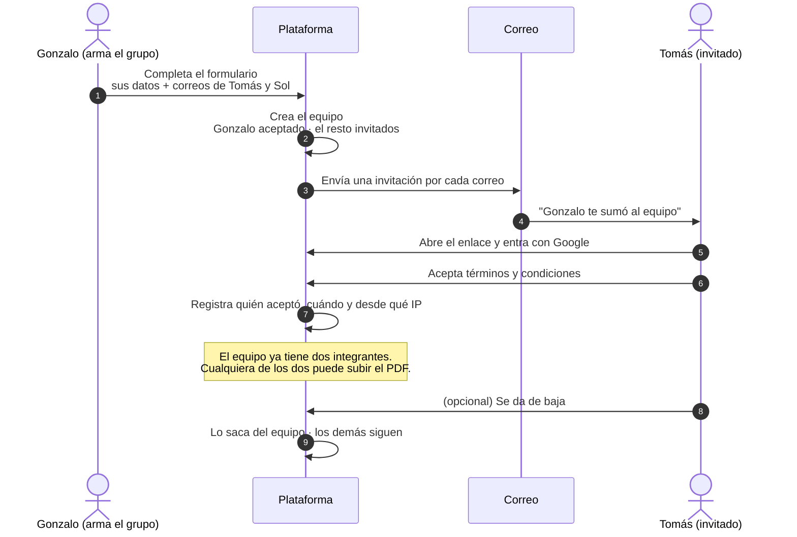
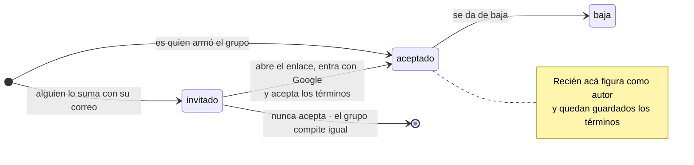
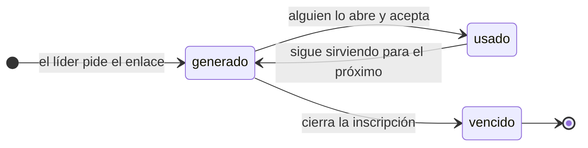

# 05 · Inscripción por grupo

Decidido en la reunión con Sol del 08.09. **Reemplaza la participación
individual** que se había modelado antes: la pregunta 01 del documento que se le
mandó quedó contestada.

## El flujo

Una sola persona anota a todo el equipo. Los demás reciben una invitación por
correo y entran por su cuenta.



## Estados de un integrante



**Si alguien nunca acepta, el grupo compite igual.** Los que aceptaron siguen
adelante y el que no simplemente no figura como autor. Se decidió así para que
un integrante distraído no hunda al equipo el día del cierre.

## Modelo

```sql
create type estado_miembro as enum ('invitado','aceptado','baja');

create table equipos (
  id          uuid primary key default gen_random_uuid(),
  nombre      text,
  creado_por  uuid not null references perfiles(id),
  creado_en   timestamptz not null default now()
);

create table equipo_miembros (
  id           uuid primary key default gen_random_uuid(),
  equipo_id    uuid not null references equipos(id) on delete cascade,
  perfil_id   uuid not null references perfiles(id),
  estado       estado_miembro not null default 'invitado',
  es_lider     boolean not null default false,
  -- El enlace del correo. Hace que la invitación funcione aunque la cuenta
  -- de Google del invitado tenga un correo distinto al que se tipeó.
  token        text unique,
  invitado_en  timestamptz not null default now(),
  aceptado_en  timestamptz,
  baja_en      timestamptz,
  -- Lo que cubre legalmente a Habisite. Se guarda al aceptar.
  terminos_en      timestamptz,
  terminos_version text,
  terminos_ip      inet,
  unique (equipo_id, perfil_id)
);

-- Nadie compite en dos equipos a la vez.
create unique index un_equipo_por_persona
    on equipo_miembros (perfil_id)
 where estado = 'aceptado';
```

Y `propuestas` deja de colgar de la persona:

```sql
-- antes:  participante_id uuid not null unique references perfiles(id)
-- ahora:
alter table propuestas
  drop column participante_id,
  add  column equipo_id uuid not null unique references equipos(id);
```

La restricción `unique` se mantiene: **una propuesta por equipo**.

## Por qué el token y no el correo

El invitado puede tener una cuenta de Google con un correo distinto al que le
tipearon. Si la invitación se resolviera comparando correos, esa persona no
podría entrar nunca y nadie entendería por qué.

Con el token, el enlace del correo identifica la invitación por sí solo: quien
lo abre y se autentica con Google queda vinculado a esa fila, sin importar con
qué cuenta entró.

## Términos y condiciones

Se guardan **por persona, no por equipo** — cada integrante acepta los suyos.
Quedan registrados el momento, la versión del texto y la IP. Sin la versión, el
día que cambien las bases no hay forma de saber qué aceptó cada uno.

El líder acepta los términos al completar el formulario inicial; los invitados,
al abrir el enlace.

## El formulario, con la menor fricción posible

El motivo número uno por el que alguien abandona una inscripción es no tener a
mano los datos de los demás. Por eso, dos decisiones:

**Del invitado solo se pide el correo.** Sus datos los carga él cuando acepta.
El líder tipea tres correos, no tres fichas completas.

**El equipo se puede crear vacío.** Uno se inscribe solo y suma gente después.

```
TUS DATOS
  Nombre y apellido
  Correo de Google   ← con este vas a entrar a la plataforma
  Universidad o trabajo
  País

TU EQUIPO
  Correos de tus compañeros    [ + agregar otro ]
  ← podés dejarlo vacío y sumarlos más adelante

  ☐ Acepto las bases
                                        [ Inscribirme ]
```

## Sumar integrantes: dos caminos

Decidido el 08.09: **conviven los dos**, porque resuelven situaciones distintas
y Tomás ya construyó el primero.

### Por correo, desde una card

Botón *Añadir miembro*, se abre una card sobre el contenido con el fondo
desenfocado, se cargan correos con un botón `+` para sumar varios de una vez, y
*Confirmar* dispara un correo a cada dirección. Sirve para invitar a alguien
puntual. Está definido en `req-concursantes.md` §3.

Su punto débil: **el correo tipeado tiene que ser el de la cuenta de Google del
invitado**. Si no coincide, esa invitación queda muerta y nadie entiende por
qué. Conviene avisarlo en la card, no después.

### Con un enlace del equipo

El equipo tiene un enlace que el líder pega en el WhatsApp del grupo. Quien lo abre entra con Google, completa sus datos,
acepta las bases y queda adentro — **y ese mismo enlace lo inscribe**, así que no
hace falta que estuviera habilitado de antes.

Resuelve dos cosas de una: el alta en la plataforma y el ingreso al equipo. Y
saca del medio el problema del correo que no coincide, porque quien lo abre se
autentica con la cuenta que quiera.



El enlace lleva un token largo y aleatorio, distinto del token de las
invitaciones individuales por correo:

```sql
alter table equipos
  add column token_invitacion text unique,
  add column invitacion_activa boolean not null default true;
```

**El riesgo es que un enlace circule más de la cuenta** y se sume alguien que no
corresponde. Se acota con tres cosas, y falta que Sol elija cuáles:

- Que el líder pueda **regenerar el enlace**, invalidando el anterior.
- Que el líder pueda **apagarlo** cuando el equipo está completo.
- Que las altas por enlace **necesiten confirmación del líder** antes de contar
  como integrantes.

En cualquier caso, **el enlace deja de funcionar cuando cierran las entregas**:
no se agregan autores después de entregar.

En los dos casos, **sumar gente se cierra junto con las entregas**: no se
agregan autores después de entregar.

## Cuando alguien se da de baja

- **La fila no se borra**, queda en `estado = 'baja'`. Hace falta para saber que
  en su momento aceptó las bases y cuándo.
- **Se avisa por correo al resto del equipo.** Si no, se enteran en la
  premiación.
- **El líder no puede irse dejando el equipo sin responsable.** Se le pasa el rol
  al integrante aceptado más antiguo, automáticamente.
- **La propuesta no se toca.** Es del equipo, no de la persona.
- **Después del cierre no se puede dar de baja.** Una vez entregada, la lista de
  autores queda firme: si no, alguien podría salirse después de ganar, o
  cambiarse la autoría con el premio ya asignado.

## Definido el 08.09

- **Tope de 5 integrantes**, guardado en `edicion.max_integrantes` y no escrito
  en el código, porque el número puede cambiar. Falta definir si los 5 incluyen
  a quien armó el equipo o son además de él.
- **Sí se pueden sumar integrantes** después del formulario inicial.
- **Una persona no puede estar en dos equipos.** Lo impone el índice único
  parcial de más arriba.

Lo que sigue abierto está en `dudas-para-sol.md`, fuera del repo.
