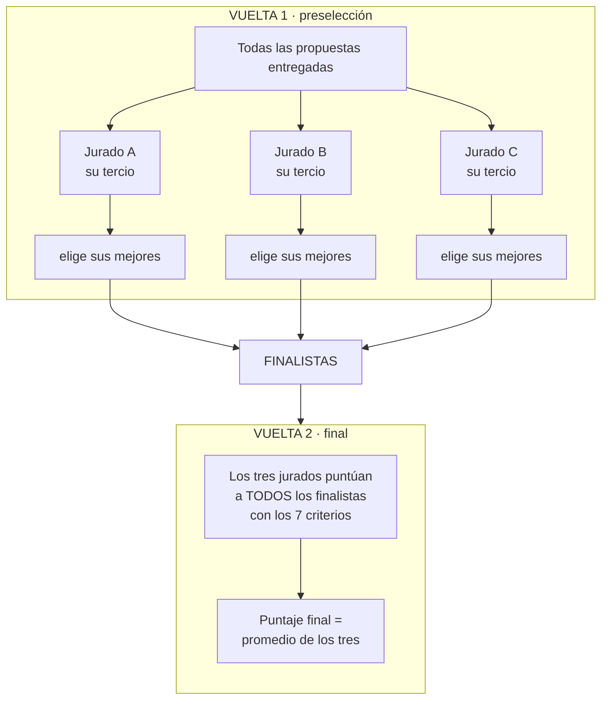

# 06 · Evaluación en dos vueltas

Decidido el 08.09. **Reemplaza el esquema donde los tres jurados calificaban
todas las propuestas.**

## El problema que resuelve

En la reunión surgió repartir el total de concursantes en tres, un tercio para
cada jurado. Eso baja muchísimo el trabajo, pero **rompe la comparación**: si
cada propuesta la califica una sola persona, un jurado exigente y uno generoso
terminan calificando tercios distintos, y el podio pasa a depender en parte de a
quién le tocó cada propuesta.

En un concurso con premio, eso es material de reclamo y no hay forma de
defenderlo en un acta.

## La solución

Dos vueltas. El reparto se usa para **filtrar**, no para **premiar**.



**La vara queda pareja donde define el premio.** En la vuelta 1 nadie recibe una
nota: el jurado solo marca qué pasa de ronda. En la vuelta 2 los tres miran lo
mismo, así que el promedio de tres notas vuelve a tener sentido.

Y el volumen sigue siendo bajo: con 300 propuestas, cada jurado revisa 100 en la
vuelta 1 y puntúa 15 finalistas en la vuelta 2, en vez de calificar 300.

## Modelo

```sql
-- Vuelta 1: quién revisa qué, y qué eligió.
create table asignaciones (
  id              uuid primary key default gen_random_uuid(),
  propuesta_id   uuid not null unique references propuestas(id) on delete cascade,
  jurado_id       uuid not null references perfiles(id),
  preseleccionada boolean not null default false,
  revisada_en     timestamptz,
  asignada_en     timestamptz not null default now()
);

-- Marca que la propuesta pasó a la vuelta 2.
alter table propuestas
  add column finalista boolean not null default false;

-- Cuántas puede elegir cada jurado en la vuelta 1.
alter table edicion
  add column cupo_preseleccion smallint;
```

`propuesta_id` es **único** en `asignaciones`: en la vuelta 1 cada propuesta
tiene un solo revisor. Es la restricción que impide que el reparto se solape.

## Lo que no cambia

`puntajes` queda **exactamente igual**, con su clave única sobre
`(propuesta_id, jurado_id, criterio_id)`. Simplemente pasa a usarse solo en la
vuelta 2, sobre los finalistas.

La consulta del ranking tampoco cambia, salvo que ahora filtra por finalistas:

```sql
with por_jurado as (
  select s.propuesta_id, s.jurado_id,
         sum(s.valor * c.peso) as puntaje
    from puntajes s
    join criterios c    on c.id = s.criterio_id and c.activo
    join propuestas p on p.id = s.propuesta_id
   where p.finalista
   group by s.propuesta_id, s.jurado_id
  having count(*) = (select count(*) from criterios where activo)
)
select propuesta_id,
       round(avg(puntaje)::numeric, 3) as puntaje_final,
       count(*) as jurados_que_evaluaron
  from por_jurado
 group by propuesta_id
 order by puntaje_final desc;
```

Y sigue valiendo la regla de `CLAUDE.md` §5.3: **ningún jurado ve las notas de
los otros hasta el cierre**. En la vuelta 2 los tres califican lo mismo, así que
ahí es donde esa regla realmente importa.

## El reparto de la vuelta 1 se automatiza

Al azar, decidido el 08.09. Se ejecuta cuando la edición pasa de `entregas` a
`preseleccion`, y lo importante es que sea **reproducible**: se guarda una
semilla, y si alguien cuestiona el sorteo se vuelve a correr y da idéntico. Eso
es lo que lo hace defendible en un acta.

```sql
alter table edicion add column semilla_reparto text;

with mezcladas as (
  -- El hash con semilla da un orden pseudoaleatorio pero repetible.
  select id,
         row_number() over (order by md5(id::text || $semilla)) - 1 as n
    from propuestas
   where estado = 'entregada'
),
jurados as (
  select id,
         row_number() over (order by id) - 1 as j,
         count(*) over ()                    as total
    from perfiles
   where rol = 'jurado' and activo
)
insert into asignaciones (propuesta_id, jurado_id)
select m.id, ju.id
  from mezcladas m
  join jurados  ju on ju.j = m.n % ju.total;
```

El `% total` reparte en round-robin, así que los tercios quedan parejos aunque
el total no sea divisible por tres. Y como `asignaciones.propuesta_id` es
único, el reparto no se puede solapar ni correr dos veces por accidente.

## Lo que falta definir


- **¿Cuántas elige cada jurado en la vuelta 1?** Es el `cupo_preseleccion`, y
  queda **en blanco a propósito** hasta que se defina. Con 5 por jurado salen 15
  finalistas; con 10, salen 30. Depende de cuántos concursantes haya.
- **¿Un jurado puede pedir que le saquen una propuesta por conocer a los
  autores?** Como ve el nombre y la universidad, se va a dar.
- **¿Qué pasa si un jurado no llega a revisar todo su tercio?** Hay que decidir
  si se reasigna a otro o si se corre la fecha.
