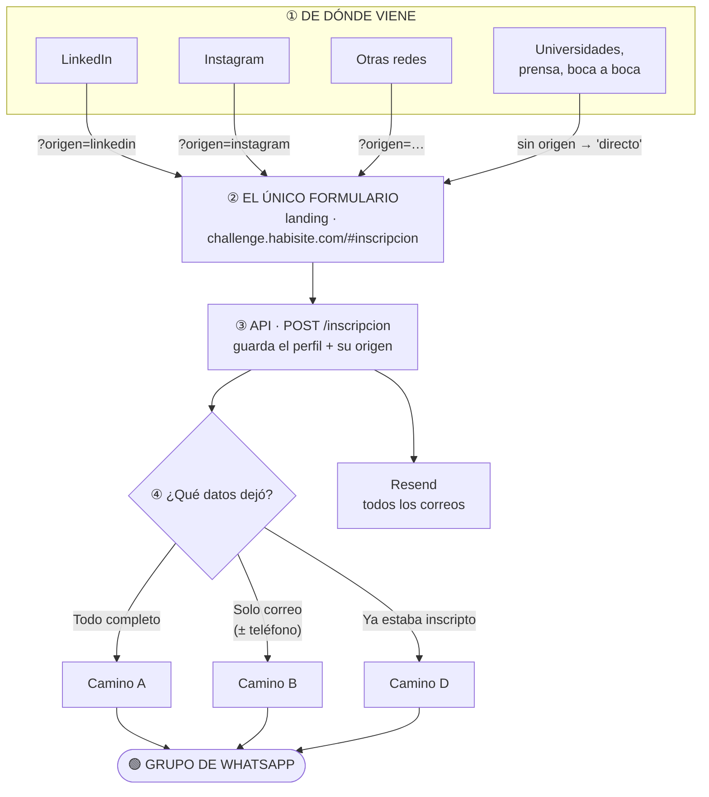
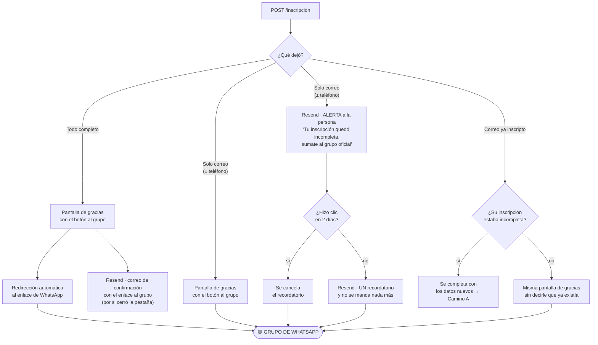
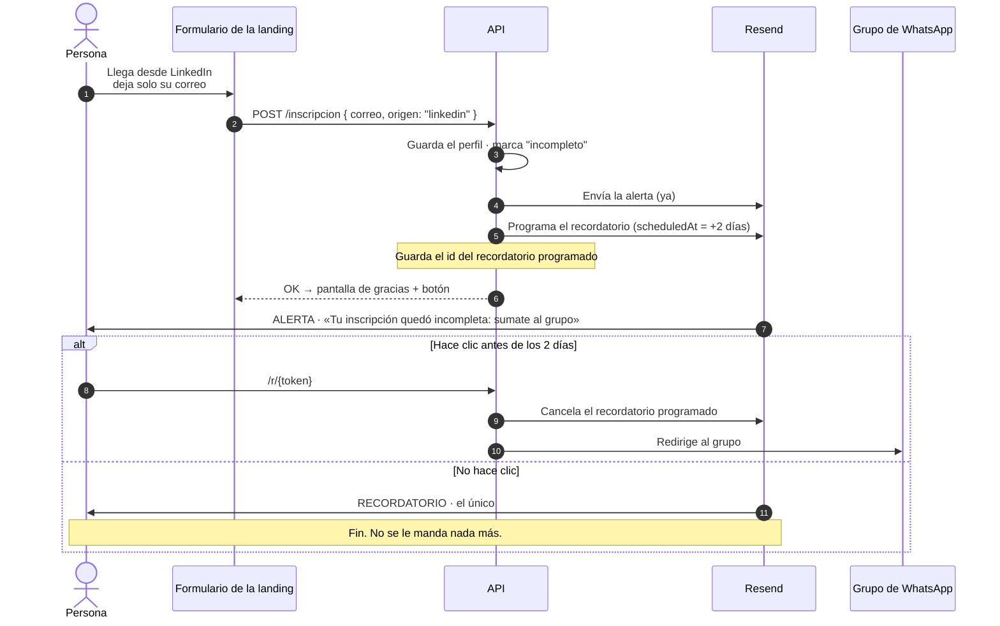

# 09 · El embudo de inscripción

**Borrador para discutir.** Nada de esto está implementado todavía.

El concurso se publicita en varios lugares a la vez: LinkedIn, Instagram,
otras redes y más. **Todos los canales llevan al mismo formulario, el de la
landing**, y de ahí todo termina en el grupo de WhatsApp. El grupo es donde se
comparte el resto de la información y los enlaces a los paneles.

## Decidido · 06.10

- **Hay un único formulario: el de la landing.** No existe otro, ni en nuestra
  web ni en LinkedIn o Meta. Los canales solo llevan gente a ese formulario.
- **Ese formulario es la inscripción**, no un pre-registro aparte: deja a la
  persona en la lista blanca de `perfiles` para entrar con Google.
- **Todo el envío de correos se hace con Resend**: la confirmación, la
  alerta, el recordatorio y el seguimiento de clics.
- **La alerta le llega a quien completó el formulario**, no al equipo de
  Habisite. Es el correo que le avisa que su inscripción quedó incompleta y le
  manda el enlace al grupo.
- **Hay un solo recordatorio, a los 2 días, y no se manda nada más.** Si
  después de ese no entra, no se le insiste. **Solo lo reciben los
  incompletos** (camino B): al que completó todo ya se lo redirigió al grupo
  en el momento.
- **Los correos del equipo no van en el formulario.** El equipo se arma
  después, desde el panel, con la card y el enlace del doc 05.
- **El incompleto puede entrar al panel**, pero lo primero que ve es el pedido
  de completar los datos que faltan. No puede armar equipo ni subir nada hasta
  hacerlo.
- **La alerta trae un botón para completar la inscripción**, que abre el
  formulario de la landing con su correo ya cargado.
- **El tilde de las bases es obligatorio siempre**, aunque deje solo el
  correo: es lo que nos permite guardar sus datos y mandarle correos. Se
  guarda con fecha, versión e IP.
- **Quien completa todo ve la pantalla de gracias y pasa solo a WhatsApp**
  después de unos segundos, con un botón por si el navegador frena la
  redirección.
- **Los correos salen de `challenge.habisite.com`**, así la reputación del
  remitente no se mezcla con la del correo del estudio.
- **El formulario lleva Cloudflare Turnstile**, más un límite de pedidos por
  IP en la API.
- **Las plantillas se hacen de cero**, con la identidad de Habisite:
  confirmación, alerta y recordatorio.
- **El grupo de WhatsApp todavía no está definido.** El enlace vive en una
  variable de entorno, así se cambia sin tocar código.

## El formulario

| Campo | Obligatorio | Notas |
|---|---|---|
| Correo | **Sí** | El de Google: con ese entra a la plataforma |
| Acepto las bases | **Sí** | Se guarda con fecha, versión e IP |
| Nombre | No | |
| Apellido | No | |
| Teléfono | No | Selector de país + número, guardado en formato internacional (`+5491…`) |
| Tipo | No | Universidad · trabajo · independiente. Lo pidió Sol |
| Universidad o trabajo | No | |
| País | No | |
| Turnstile | — | Invisible para la persona |
| `origen` | — | Lo lee el front de la URL, no se pregunta |

**Está completo** cuando tiene nombre, apellido, tipo, institución y país. El
teléfono no cuenta para eso.

---

## 1 · El embudo completo

### El origen viaja en la URL

Cada publicación lleva su propio enlace a la landing, por ejemplo
`challenge.habisite.com/?origen=linkedin`. El front lee el parámetro y lo manda
junto con el formulario. Así se sabe qué canal trae más gente sin que nadie
tenga que preguntarle a la persona.

---

## 2 · Las bifurcaciones

### Qué es cada camino

| Camino | Qué dejó | Qué pasa | Por qué |
|---|---|---|---|
| **A** | Todo | Va directo al grupo, y además le llega un correo con el enlace | El correo cubre al que cerró la pestaña antes de entrar al grupo |
| **B** | Solo correo, o correo y teléfono | Le llega **la alerta** con el enlace al grupo. Si en 2 días no hizo clic, **un** recordatorio y nada más | Se guarda igual: perder a alguien porque no quiso escribir su universidad es peor que tenerlo incompleto |
| **D** | Ya estaba inscripto | Si estaba incompleto, se completa. Si no, le mostramos lo mismo que a cualquiera | Decir «ya estás inscripto» deja averiguar quién se anotó. El nuevo origen se guarda igual |

**El correo es obligatorio.** Sin correo no hay alerta, no hay recordatorio y
no hay forma de entrar a la plataforma, porque la lista blanca se resuelve por
correo. Por eso no existe un camino «solo teléfono».

---

## 3 · La línea de tiempo de una persona del camino B

### El recordatorio lo programa Resend, no un cron nuestro

Resend permite **programar un correo para más adelante** (`scheduledAt`) y
**cancelarlo** antes de que salga. Eso alcanza para todo el recordatorio:

1. Cuando entra la inscripción, se manda la alerta y **en el mismo momento**
   se programa el recordatorio para dentro de 2 días.
2. Se guarda el `id` de ese correo programado.
3. Si la persona hace clic antes, se cancela con ese `id`.
4. Si no hace clic, sale solo. Como nunca se programa un segundo, **no puede
   haber más de un recordatorio**, ni por un error de código.

Así no hace falta ningún proceso nuestro corriendo cada tanto. Tampoco se
pierden recordatorios si la API se reinicia o se cae, porque los guarda Resend.

### Por qué el enlace pasa primero por nuestra API

El enlace de los correos es `/r/{token}`: pasa por la API y recién de ahí va a
WhatsApp.

1. **Es lo que cancela el recordatorio.** WhatsApp no avisa quién entró al
   grupo, así que el clic es la única señal que tenemos.
2. **Podemos cambiar el grupo sin reenviar nada.** Si el grupo se llena (el
   tope es 1024 personas) o hay que regenerar el enlace, se cambia una
   variable y todos los correos ya enviados siguen funcionando.

> Resend también puede rastrear clics por su cuenta y avisarnos por webhook.
> Lo descartamos para esto: reescribe los enlaces con su dominio y el aviso
> llega de forma asincrónica. El redirect propio es más simple y no depende de
> que el webhook llegue.

---

## 4 · Qué cambia en lo que ya existe

El formulario de la landing pasa a llamar a `POST /inscripcion`, que ya existe
pero hoy pide todos los campos y no manda ningún correo.

| Hoy | Con el embudo |
|---|---|
| Todos los campos son obligatorios | Solo el **correo** es obligatorio |
| No hay teléfono | Columna `telefono` en `perfiles` |
| No se sabe de dónde vino | Columna `origen` en `perfiles` |
| No se sabe si está completo | Se calcula: le falta nombre, apellido, tipo, institución o país |
| Correo repetido → `409` | Correo repetido → completa lo que faltaba, o responde igual que siempre |
| No manda nada | Confirmación o alerta, más el recordatorio programado, por Resend |
| — | Guarda el `id` del recordatorio y el token del enlace `/r/{token}` |
| — | `GET /r/{token}`: cuenta el clic, cancela el recordatorio y redirige al grupo |

| No hay aceptación de bases en la inscripción | Columnas `terminos_en`, `terminos_version`, `terminos_ip` también en `perfiles` |
| — | Validación del token de Turnstile y límite de pedidos por IP |
| — | `GET /yo` avisa si el perfil está incompleto; el panel pide completarlo antes de seguir |

---

## 5 · Preguntas que quedan

1. **El grupo de WhatsApp**: ¿uno, una Comunidad, varios? No bloquea, porque
   el enlace va en una variable.
2. **El texto de las bases** y su versión. El tilde es obligatorio, así que
   hace falta un enlace a algo, aunque sea una versión preliminar.
3. **Verificar `challenge.habisite.com` en Resend**: hay que cargar sus
   registros (SPF, DKIM y MX de retorno) en Cloudflare.
