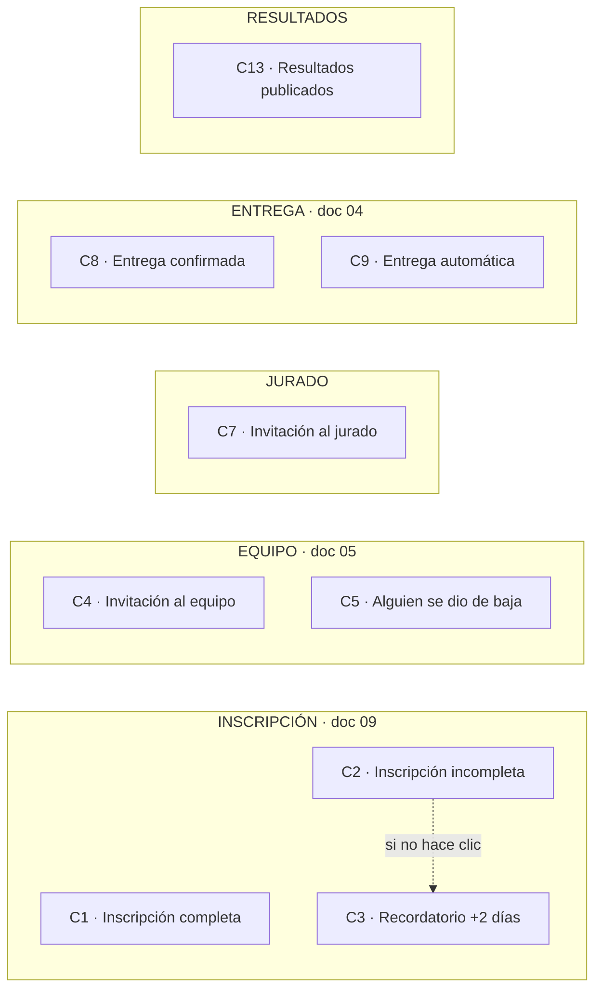

# 10 · Los correos de la plataforma

**Implementados el 08.10, los diez.** Las plantillas están en
`src/correo/plantillas.ts`. Todos salen por **Resend**, desde
`Habisite Design Challenge <noreply@habisite.com>`, **sin dirección de
respuesta** (decidido el 08.10). Las consultas van al grupo de WhatsApp, que es
el canal oficial; el pie de cada correo lo dice. Lo que alguien responda igual
lo descarta una regla de Cloudflare Email Routing, sin rebote. Al jurado, que
no está en ese grupo, el pie le dice que contacte a la organización.

Este documento es el catálogo: qué correo existe, qué lo dispara, a quién le
llega y qué lleva. Las plantillas se diseñan de cero con la identidad de
Habisite.

---

## El mapa

## Resumen

| # | Correo | Lo dispara | Le llega a | Estado |
|---|---|---|---|---|
| C1 | Inscripción completa | `POST /inscripcion` con todos los datos | Quien se inscribió | **Pedido** · doc 09 |
| C2 | Inscripción incompleta (la alerta) | `POST /inscripcion` solo con el correo | Quien se inscribió | **Pedido** · doc 09 |
| C3 | Recordatorio | La tarea periódica, 2 días después de C2, si no hizo clic | Quien se inscribió | **Pedido** · doc 09 |
| C4 | Invitación al equipo | `POST /mi-equipo/invitaciones` | Cada correo invitado | **Pedido** · req-concursantes §3 |
| C5 | Alguien se dio de baja | `DELETE /mi-equipo/miembros/yo` | El resto del equipo | **Pedido** · doc 05 |
| C7 | Invitación al jurado | El admin suma un jurado | El jurado | **Pedido** · req-jurado §1, **falta el endpoint** |
| C13a | Ganaste | `POST /admin/resultados/publicar` | Los equipos del podio | **Pedido** · resuelto 08.10 |
| C13b | Ya se publicaron los resultados | `POST /admin/resultados/publicar` | El resto de los equipos que entregaron | **Pedido** · resuelto 08.10 |
| C8 | Entrega confirmada | `POST /mi-propuesta/entregar` | Todo el equipo | **Aprobado** 08.10 |
| C9 | Entrega automática | El cierre pasa el borrador a entregado | Todo el equipo | **Aprobado** 08.10 |

---

## Los pedidos

### C1 · Inscripción completa

- **Cuándo:** la inscripción llega con nombre, apellido, tipo, institución y
  país. También cuando alguien del camino B vuelve y completa lo que faltaba.
- **Asunto:** «Ya estás inscrito en el Habisite Design Challenge 2026» (los
  correos van en «tú» neutro, como la landing)
- **Lleva:**
  - el botón al grupo de WhatsApp, por `/r/{token}`;
  - el recordatorio de entrar con **ese mismo correo de Google**;
  - el enlace a las bases.
- **Por qué existe:** la pantalla ya lo redirigió al grupo; el correo cubre al
  que cerró la pestaña antes de entrar.

### C2 · Inscripción incompleta (la alerta)

- **Cuándo:** la inscripción llega solo con el correo, o con correo y teléfono.
- **Asunto:** «Te falta un paso para el Habisite Design Challenge»
- **Lleva:**
  - el botón **«Completar mi inscripción»**, que abre el formulario de la
    landing ya cargado por medio de un token;
  - el botón al grupo de WhatsApp, por `/r/{token}`.
- **Al enviarlo:** se guarda `recordatorio_para = ahora + 2 días`.

### C3 · Recordatorio

- **Cuándo:** 2 días después de C2. **Uno solo, nunca más que eso.**
- **Solo para el camino B.** El que completó todo no lo recibe.
- **No sale** si antes hace clic en `/r/{token}` o completa la inscripción.
- **Lleva** lo mismo que C2, con otro texto.
- **Cómo:** lo manda la tarea de la API que corre cada 30 minutos. No se
  programa en Resend porque la clave de solo envío no puede cancelar (probado
  el 08.10). El detalle está en el doc 09.

### C4 · Invitación al equipo

- **Cuándo:** el líder carga correos en la card «Añadir miembro».
- **Asunto:** «{Nombre del líder} te invitó a su equipo del Habisite Design
  Challenge»
- **Lleva** (req-concursantes §15 y §16):
  - el botón **«Confirmar mi participación»**;
  - el enlace directo a los **términos y condiciones**;
  - el aviso de que tiene que entrar con su cuenta de Google.
- ⚠ **Hoy el enlace no funciona:** se genera `/invitacion/{token}`, pero **no
  existe ningún endpoint que lo acepte**. Hay que hacerlo junto con el correo.
- ⚠ **Bloqueado por las bases:** el texto de los términos no existe todavía
  (`CLAUDE.md` §8.7).

### C5 · Alguien se dio de baja

- **Cuándo:** un integrante se da de baja.
- **Le llega a:** los integrantes aceptados que siguen en el equipo.
- **Lleva:**
  - quién se fue;
  - si era el líder, **quién pasa a serlo**, porque el rol se traspasa solo al
    integrante más antiguo (doc 05).
- **Por qué existe:** el doc 05 lo pide para que el resto no se entere en la
  premiación.

### C7 · Invitación al jurado

- **Cuándo:** el admin suma a un jurado. req-jurado §1: «se invita uno por uno».
- **Asunto:** «Te invitamos a ser jurado del Habisite Design Challenge 2026»
- **Lleva:**
  - el botón para entrar con Google;
  - el aviso de que tiene que ser **exactamente ese correo**.
- ⚠ **No existe el endpoint** para que el admin invite jurados. El repositorio
  ya tiene `asegurarPorCorreo(correo, 'jurado')`, pero ninguna ruta lo usa.

### C13 · Resultados publicados

Resuelto el 08.10: **un correo a los ganadores y un aviso general al resto.**
`CLAUDE.md` §6.4 y req-concursantes §4.19 decían cosas distintas; esto los
reemplaza a los dos.

- **C13a · Ganaste**, a cada integrante aceptado de los equipos del podio.
  Dice que entraron entre los tres primeros y en qué puesto. Además se les
  avisa por el panel y por WhatsApp.
- **C13b · Ya se publicaron los resultados**, a los integrantes del resto de
  los equipos que entregaron. Solo dice que se publicaron y enlaza al panel.
- **Lo que no puede llevar nunca:** puntaje, nota, posición fuera del podio ni
  devolución. C13b no dice «no ganaste»: dice que ya están los resultados.

### C14 · Tu enlace para entrar · 09.10

Lo pide la persona desde la pantalla de ingreso, en vez de entrar con Google
(ver [doc 12](12-ingreso-por-enlace.md)). Le llega a cualquier rol, así que
lleva el pie neutro del jurado y no manda al grupo. Vence a los 15 minutos y
sirve una vez. La clave es la del enlace (`c14:{id}`), no la de la persona:
cada pedido es un correo distinto.

---

## Los propuestos que se aprobaron · 08.10

### C8 · Entrega confirmada

- **Cuándo:** el equipo aprieta «Entregar».
- **Le llega a:** todos los integrantes aceptados.
- **Lleva** la fecha, la hora con zona horaria y el nombre del archivo. Sirve
  de **comprobante**: es lo primero que alguien muestra cuando reclama «yo lo
  subí».
- **Si reemplaza el PDF después de entregar**, se manda de nuevo con el
  archivo nuevo.

### C9 · Entrega automática

- **Cuándo:** vence el cierre más los 15 minutos de gracia y el borrador, que
  tenía archivo, pasa solo a `entregada` (doc 04).
- **Le llega a:** todos los integrantes aceptados.
- **Lleva** el aviso de que **compite igual** aunque no haya confirmado, con el
  nombre del archivo que quedó.

### Descartados por ahora

No se hacen en esta etapa. Si hacen falta, se suman con el mismo servicio.

| # | Correo |
|---|---|
| C6 | Alguien se sumó → al líder |
| C10 | Se acerca el cierre |
| C11 | Descalificación |
| C14 | Empieza una vuelta → a los jurados |

## Lo que queda afuera a propósito

- **Ningún correo al equipo de Habisite** por cada inscripción. La alerta es
  para la persona (doc 09). Para ver las inscripciones está el admin.
- **Nada de resúmenes ni boletines.** Lo que es información general va al
  grupo de WhatsApp.
- **Ningún correo con la devolución o el puntaje.** El concursante no los ve
  nunca.

---

## Reglas técnicas para todos

1. **Ningún correo frena la acción que lo dispara.** Si Resend falla, la
   inscripción, la invitación o la entrega se guardan igual: el error queda en
   el log y en una tabla de envíos para poder reintentar.
2. **Clave de idempotencia por envío.** Por ejemplo, `c1:{perfilId}` o
   `c8:{propuestaId}`. Si un pedido se repite, Resend no manda el correo dos
   veces.
3. **Etiquetas (`tags`) en Resend** con el código del correo (`c1`, `c4`…),
   para filtrar en el panel de Resend qué salió y qué rebotó.
4. **Todo enlace a WhatsApp pasa por `/r/{token}`**, nunca directo, así se
   frena el recordatorio y se puede cambiar el grupo sin reenviar nada.
5. **Texto plano además del HTML**, para que no caigan en spam.

## Cómo quedó implementado · 08.10

- **Cada correo se anota antes de salir** en la tabla `envios`: código,
  destinatario, la clave y los datos con los que se arma la plantilla. La API
  responde enseguida y el correo sale después, desde una cola.
- **La cola manda de a uno, cada 600 ms.** Resend admite 2 envíos por segundo:
  el día que se publiquen los resultados salen cientos juntos, y sin esto
  Resend los rechazaría.
- **Estados:** `pendiente` → `enviado`, o `fallido` (se reintenta hasta 5
  veces, desde la tarea periódica). `omitido` es cuando no hay
  `RESEND_API_KEY`: en local y en el recorrido de pruebas no sale nada de
  verdad, solo queda anotado.
- **La clave de cada envío incluye al destinatario**, porque cada fila es un
  correo a una persona: por ejemplo `c8:{propuesta}:{versión del PDF}:{perfil}`.
- **Para ver las plantillas sin mandar nada**: armarlas con `armarCorreo()`
  desde `dist/correo/plantillas.js` y abrir el HTML.
