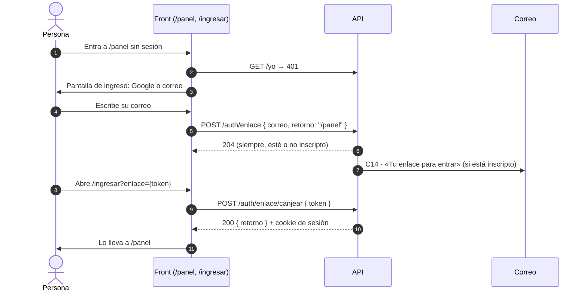

# 12 · Ingreso con un enlace por correo

**Implementado el 09.10**, decidido con Tomás. Es la segunda forma de entrar,
además de Google, para quien no usa Gmail. **Sigue sin haber contraseñas.**

## Por qué un enlace y no una contraseña

Se pidió «correo y contraseña». El problema es crearla: si cualquiera que
conozca un correo inscripto puede ponerle contraseña desde la pantalla de
ingreso, se queda con la cuenta de otro. Así que crear o recuperar una
contraseña igual exige un enlace que llegue a ese correo. Si ya hace falta el
enlace, el enlace solo alcanza: sin hash de contraseñas, sin «olvidé mi
contraseña», sin límite de intentos fallidos que custodiar.

## El recorrido

## Las reglas

- **La misma lista blanca que Google.** Solo recibe enlace quien tiene perfil:
  inscripto por el formulario, invitado, jurado o admin. Los bloqueados no.
- **La respuesta es siempre 204.** Decir «ese correo no figura» permitiría
  averiguar quién se anotó.
- **Vence a los 15 minutos y sirve una sola vez.** El canje es un único
  `update … where usado_en is null and vence_en > now() returning`: dos canjes
  simultáneos no pueden ganar los dos.
- **Se guarda el sha256 del token**, nunca el token. Con una copia de la base
  no se entra como nadie.
- **Hasta 3 enlaces por persona cada 15 minutos**, y el límite por IP del
  formulario (20 cada 15 minutos, contador propio).
- **El canje es un POST desde el front, no un GET a la API.** Los antivirus de
  correo (Outlook, Gmail) abren los enlaces para revisarlos; si el enlace
  fuera directo a la API, lo gastarían antes que la persona.
- **Entrar por primera vez pasa el perfil a `activo`**, igual que con Google.

## Lo que se agregó

| | |
|---|---|
| Migración | `004-enlace-de-ingreso.sql`: tabla `enlaces_ingreso` |
| Endpoints | `POST /auth/enlace` y `POST /auth/enlace/canjear` |
| Código | `src/auth/enlace-ingreso.{service,repository}.ts`, `src/auth/dto/enlace-ingreso.dto.ts` |
| Correo | `c14` en `plantillas.ts`, con el pie neutro porque le llega a cualquier rol |
| Enlace | `Enlaces.ingresoPorCorreo()` → `{FRONTEND_URL}/ingresar?enlace={token}` |

## Del lado del front

- **Una sola URL para los tres roles: `/panel`** (decidido el 09.10). Pregunta
  `GET /yo` y muestra la vista del rol. Sin sesión, el ingreso, que vuelve a
  `/panel`. `/jurado` y `/admin` redirigen a `/panel`.
- `/ingresar` canjea `?enlace=` y muestra los errores de Google (`?error=`).
  Si ya hay sesión, manda a `/panel`.
- El admin entra a su vista y desde ahí puede mirar la de concursante y la de
  jurado, con un botón para volver.
